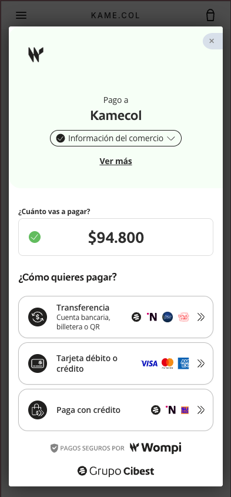
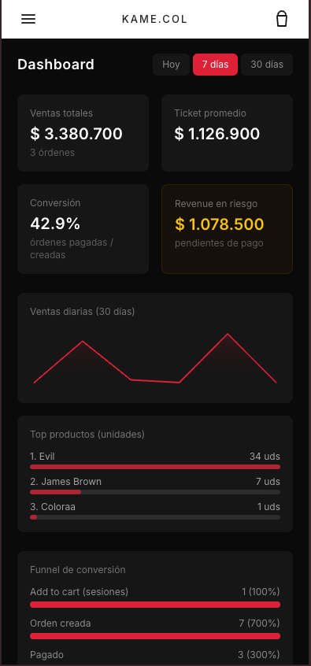
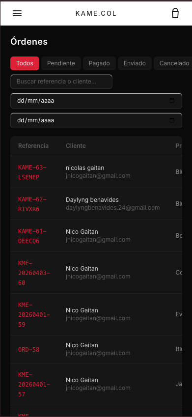

## 🚀 Kame.col

[]()
[]()
[]()
[]()
[]()

## 🌐 Live Product

👕 **https://www.kamecol.com/**

Tienda e-commerce **streetwear**: **Django + DRF** (API y admin), **Next.js 14** (storefront), **PostgreSQL**, pagos **Wompi**, correo **Resend**. Incluye panel interno, analytics y flujo de compra estándar (carrito → checkout → pago → pedido).

## ✨ Features

- Catálogo, carrito, checkout y gestión de pedidos
- Pagos y webhooks **Wompi**; emails transaccionales **Resend**
- Admin interno (catálogo, órdenes, clientes) con **2FA**
- Inventario y variantes de producto
- Eventos de comportamiento en storefront (analytics)
- **Sentry** (backend + frontend) y **Bandit** en CI sobre Python
- E2E **Playwright** (ver `tests/README.md`)

## 🧱 Tech Stack

| Layer | Tech |
|------|------|
| Backend | Django 5.2 + DRF |
| Frontend | Next.js 14 (App Router) |
| Database | PostgreSQL |
| State | Zustand |
| Styling | Tailwind CSS |
| Payments | Wompi |
| Emails | Resend |
| Testing | Playwright |
| Observabilidad | Sentry |
| CI — seguridad (Python) | [Bandit](https://bandit.readthedocs.io/) en GitHub Actions (`apps/`, `config/`; umbral Medium+) |

**CI:** además de Bandit, **GitHub Actions** ejecuta **E2E** (build de Next + Playwright en `tests/`). Detalle Bandit: sección más abajo.

## 📸 Screenshots

### 🏠 Storefront


### 🛒 Checkout


### 📊 Admin Dashboard


### 📦 Orders Management


## ⚡ Quick Start

### Backend

```bash
python -m venv .venv
source .venv/bin/activate   # Windows: .venv\Scripts\activate
pip install -r requirements/base.txt
```

Creá `.env` en la raíz (no commitear) con al menos: `DJANGO_SECRET_KEY`, `DJANGO_DEBUG=True`, `DJANGO_ALLOWED_HOSTS`, variables `DB_*` para PostgreSQL, claves **Wompi** y `RESEND_API_KEY`. La configuración de base de datos sigue `config/settings.py` leyendo esas variables.

```bash
python manage.py migrate
python manage.py createsuperuser
python manage.py runserver
```

API típica: **http://127.0.0.1:8000**

### Frontend

```bash
cd frontend
npm install
npm run dev
```

Storefront: **http://localhost:3000** — el proxy `/api` necesita el backend en marcha y `DJANGO_API_BASE` (u origen equivalente) en `frontend/.env.local` según tu entorno.

## 🔭 Sentry (resumen)

- Backend y frontend usan **proyectos / DSN distintos** en Sentry. Backend: `SENTRY_DSN` y `DJANGO_ENV` en `.env` raíz. Frontend: `NEXT_PUBLIC_SENTRY_DSN`, `NEXT_PUBLIC_ENV` en `frontend/.env.local`; token de source maps (`SENTRY_AUTH_TOKEN`) en `frontend/.env.local` para builds con Sentry.
- **Producción:** en el panel del host (p. ej. Render / Vercel) definí esas variables sin mezclar varias en un solo campo.
- **Probar backend:** `python manage.py verify_sentry` (requiere `SENTRY_DSN`).
- **Probar browser (storefront):** en consola, `__KAME_SENTRY_TEST__.captureException(new Error("test"))` y opcionalmente `await __KAME_SENTRY_TEST__.flush(5000)`; en dev suele usarse el túnel `/api/sentry-tunnel`.

No subas `.env`, `frontend/.env.local` ni tokens al repositorio.

## 🧪 Tests y CI

| Qué | Dónde |
|-----|--------|
| E2E Playwright | `tests/README.md` — `cd tests && npm ci && npx playwright install chromium && CI=true npx playwright test` |
| Bandit (Python) | Esta repo: sección **Bandit** abajo; en CI: workflow en `.github/workflows/bandit.yml` |

Deuda técnica, riesgos y roadmap de producto: **`TECH_DEBT_AND_ROADMAP.md`**.

## 📦 Estructura (resumen)

```
kame.colStore/
├── apps/           # catalog, orders, customers, notifications, admin_api, …
├── config/         # Django settings, urls
├── frontend/       # Next.js storefront
├── tests/          # Playwright E2E
├── .github/workflows/
├── pyproject.toml  # Bandit [tool.bandit]
└── requirements/
```

## ⚠️ Troubleshooting

- **502 / backend unreachable en `/api/...`:** levantá Django y revisá `DJANGO_API_BASE` (o URL del proxy) en `frontend/.env.local`.
- **ECONNREFUSED :8000:** API no está corriendo.
- **Webhooks Wompi en local:** suele hacer falta un túnel (p. ej. ngrok) hacia el puerto del backend.
- **Fuentes `.woff2` 404 en dev:** borrá `frontend/.next` y volvé a `npm run dev`.

## 📌 Roadmap (alto nivel)

- Integraciones de envío (couriers)
- Evolución de catálogo / promos / recomendaciones
- CI ampliado (p. ej. lint frontend en Actions) y observabilidad tipo métricas — ver `TECH_DEBT_AND_ROADMAP.md`


## 🔒 Bandit (análisis estático de seguridad)

En **GitHub Actions** (PR y push a `main`) se ejecuta Bandit sobre `apps/` y `config/`. Config: `pyproject.toml` → `[tool.bandit]`.

**Igual que CI** (solo hallazgos Medium+):

```bash
pip install "bandit[toml]>=1.7.0"
bandit -r apps config -ll -c pyproject.toml
```

**Auditoría amplia** (incluye Low, p. ej. `B110` / `B112`; el exit code suele ser ≠ 0):

```bash
bandit -r apps config -c pyproject.toml
```

Con **`-ll`**, el CI y este comando coinciden: los ~16 avisos Low no fallan el job.

---

## 🧪 Testing E2E (Playwright)

Comandos, specs y `.env.test`: **`tests/README.md`**.

```bash
cd tests && npm ci && npx playwright install chromium
CI=true npx playwright test
```
## 👨‍💻 Author

Nicolás Gaitán  
QA Engineer | Backend | E-commerce Builder

## ⭐ Contribuciones

PRs y feedback son bienvenidos.